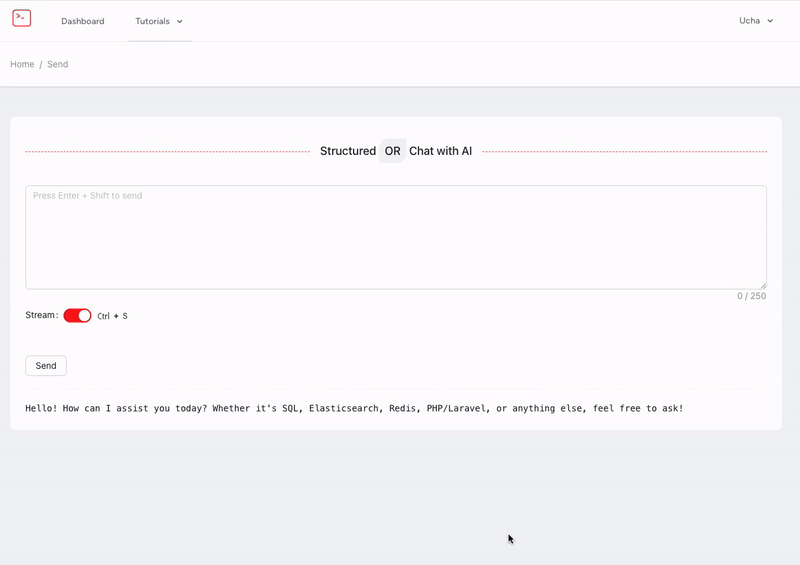

## About This Project

This is the demonstration of the project that utilizes LLM models (Phi4 and DeepSeek) with predetermined parameters.
Response is being streamed to the client in real-time.

### Technology stack

Laravel, ReactJS, InertiaJS, TailwindCSS, PostgreSQL (pgVector), Docker, Selenium, Prism, Dusk

### TODO

- [x] Use vector database for embeddings
- [x] Use LLM models for embeddings. RAG
- [x] Scape data from the web
- [ ] Output `specialized` data based on the scraped data + LLM embeddings

### Demo

<a href="https://nuc.ge/" target="_blank">nuc.ge</a>

